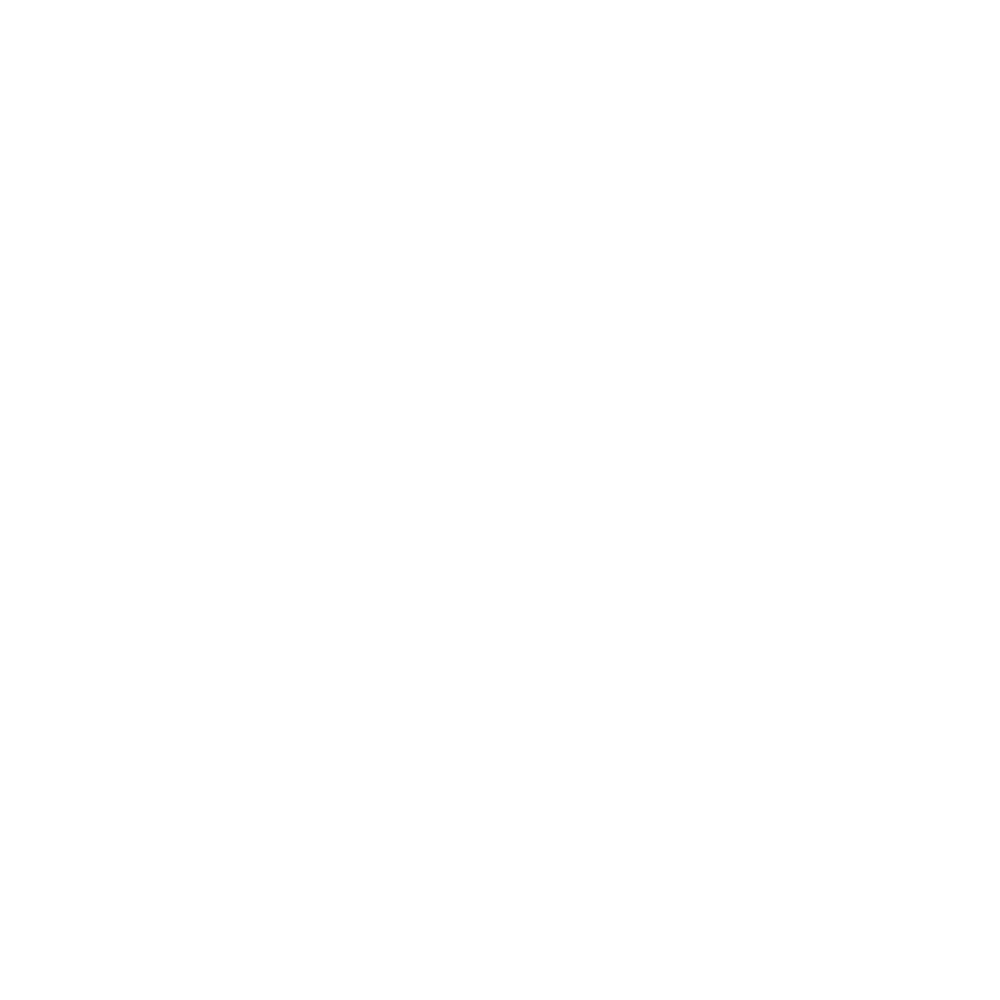

# chaos

## chaos crisp

Generates a PNG of the n-gon attractor from the chaos game, the following example with 10 roots.


```
Usage of /home/user/go/bin/crisp:
  -fuzz float
        how fuzzy it should be
  -prop float
        proportion of distance to move per step (0 for automatic)
  -roots int
        n roots of unity (which n-gon) (default 3)
  -steps int
        number of steps per frame (dots drawn) (default 5000000)
  -width int
        image width (default 1080)
```

## chaos resolve

Generates an animation showing the attractor with a sequence of proportions of step length.


```
Usage of /home/user/go/bin/resolve:
  -fuzz float
        how fuzzy it should be
  -prop-end float
        ending proportion value (default 0.01)
  -prop-inc float
        proportion increment value (default -0.01)
  -prop-start float
        start proportion value (default 1)
  -roots int
        n roots of unity (default 3)
  -steps int
        number of steps per frame (dots drawn) (default 10000)
  -width int
        image width (default 1080)
```

## chaos reveal

Generates an animation showing the forming of the attractor as more steps are taken in the game.


```
Usage of /home/user/go/bin/reveal:
  -frames int
        number of frames (default 100)
  -fuzz float
        how fuzzy it should be
  -prop float
        proportion of distance to move per step (0 for automatic)
  -roots int
        n roots of unity (default 3)
  -steps int
        number of steps per frame (dots drawn) (default 1000)
  -width int
        image width (default 1080)
```

## chaos glitch

Generate an animation of 3 attractor, one of red, green and blue each, with each frame being fuzzed.


```
Usage of /home/user/go/bin/glitch:
  -frames int
        number of frames (default 100)
  -fuzz float
        how fuzzy it should be (default 0.05)
  -prop float
        proportion of distance to move per step (0 for automatic)
  -roots int
        n roots of unity (default 3)
  -steps int
        number of steps per frame (dots drawn) (default 100000)
  -width int
        image width (default 1080)
```
